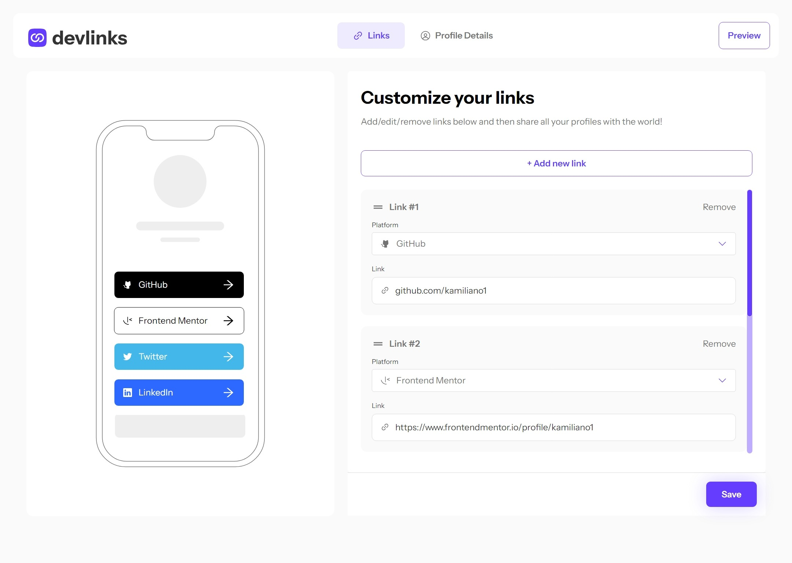
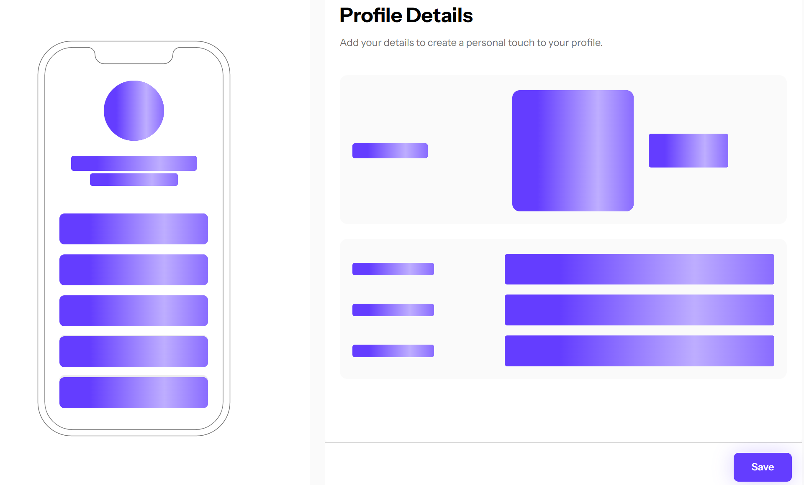

# Frontend Mentor - Link-sharing app solution

This is a solution to the [Link-sharing app challenge on Frontend Mentor](https://www.frontendmentor.io/challenges/linksharing-app-Fbt7yweGsT). Frontend Mentor challenges help you improve your coding skills by building realistic projects.

## Table of contents

- [Frontend Mentor - Link-sharing app solution](#frontend-mentor---link-sharing-app-solution)
  - [Table of contents](#table-of-contents)
  - [Overview](#overview)
    - [The challenge](#the-challenge)
    - [Screenshot](#screenshot)
    - [Links](#links)
  - [My process](#my-process)
    - [Built with](#built-with)
    - [What I learned](#what-i-learned)
      - [React Hooks Form](#react-hooks-form)
      - [React Recoil](#react-recoil)
      - [React-loading skeleton](#react-loading-skeleton)
      - [react-icons](#react-icons)
      - [react-spinners](#react-spinners)
      - [firebase](#firebase)
      - [dnd-kit](#dnd-kit)
      - [Radix-UI](#radix-ui)
    - [Continued development](#continued-development)
    - [Useful resources](#useful-resources)
  - [Author](#author)
  - [Acknowledgments](#acknowledgments)

## Overview

### The challenge

Users should be able to:

- Create, read, update, delete links and see previews in the mobile mockup
- Receive validations if the links form is submitted without a URL or with the wrong URL pattern for the platform
- Drag and drop links to reorder them
- Add profile details like profile picture, first name, last name, and email
- Receive validations if the profile details form is saved with no first or last name
- Preview their devlinks profile and copy the link to their clipboard
- View the optimal layout for the interface depending on their device's screen size
- See hover and focus states for all interactive elements on the page
- **Bonus**: Save details to a database (build the project as a full-stack app)
- **Bonus**: Create an account and log in (add user authentication to the full-stack app)

### Screenshot



### Links

- Solution URL: [https://github.com/kamiliano1/link-sharing](https://github.com/kamiliano1/link-sharing)
- Live Site URL: [https://link-sharing-iota.vercel.app/](https://link-sharing-iota.vercel.app/)

## My process

### Built with

- Semantic HTML5 markup
- Mobile-first workflow
- [React](https://reactjs.org/) - JS library
- [Next.js](https://nextjs.org/) - React framework
- [TailwindCSS](https://tailwindcss.com/)
- [React Recoil](https://recoiljs.org/)
- [React hooks form](https://react-hook-form.com/)
- [React-loading skeleton](https://www.npmjs.com/package/react-loading-skeleton)
- [React-firebase-hooks](https://www.npmjs.com/package/react-firebase-hooks)
- [firebase](https://firebase.google.com/)
- [radix-ui](https://www.radix-ui.com/)
- [dndKit](https://dndkit.com/)

### What I learned

#### React Hooks Form

The first time I was using it with the useFieldArray hook to generate a dynamic form I depended on the user links. It was useful for adding and removing links. It was quite challenging was connect the React Hooks Form with the Radix UI Select element. Finally, I managed to solve the problem using the Controller from React Hooks Form.

#### React Recoil

To manage the state I've used

```js
userAccountAtom.ts;
```

It keeps all the users' information he provided. It's updating on every user change.

```ts
  firstName?: string;
  lastName?: string;
  email?: string;
  picture?: string;
  userLink: UserLink[];
  isLoaded: boolean;
  isAvatarChanged: boolean;
```

isLoaded is preventing from loading data from the firebase more than one time.
userLink array takes care of all links created by the user

```ts
type UserLink = {
  platform: PlatformsType;
  link: string;
  id: string;
  order: number;
};
```

Order was created to have the correct position on the application and on the firebase. When the user uses drag and drop it also updates the order and the firebase collection

```ts
const snippetQuery = query(
  collection(firestore, `users/${userId}/userLinks`),
  orderBy("order", "asc")
);
```

#### React-loading skeleton

Improve the user experience when the web is loading.



#### react-icons

Instead of the SVG icons I've used react-icons.

#### react-spinners

Was used to show the loading state on the buttons when the changes are updated to the firebase.

#### firebase

Was used to save user details to the firebase. It keeps all provided by user credentials.
Links are stored in the userLinks collection:

```ts
type UserLink = {
  id: string;
  link: string;
  order: number;
  platform: PlatformsType;
};
```

Avatars are stored in the firebase storage in the folder:

```ts
`avatars/${userId}/image`;
```

#### dnd-kit

Was used for drag and drop links features.

#### Radix-UI

To improve accessibility:

- radix-ui/react-dialog was used to log in and Register Modal
- radix-ui/react-navigation-menu to the Navbar
- radix-ui/react-select displays a list of all platforms that the user can choose
- radix-ui/react-toast for the popUp when using save changes or copy the user link to the clipboard

### Continued development

- Right now all links have unique backgrounds and font colors. Improve user options to have a way to change the color of each platform.
- Give users a way to add additional platforms.

### Useful resources

- [Code a Reddit Clone with React, Next.js, firebase v9, Chakra UI – Full Course](https://www.youtube.com/watch?v=rCm5RVYKWVg&t) - This course helped me on how to implement firebase to this project.

## Author

- Website - [Kamil Szymon](https://github.com/kamiliano1)
- Frontend Mentor - [@kamiliano1](https://www.frontendmentor.io/profile/kamiliano1)

## Acknowledgments

As I mentioned before I want to thank you for the Reddit clone course. It was much helpful when I was working on this project. It showed step-by-step how to start working with firebase and how to use it.
